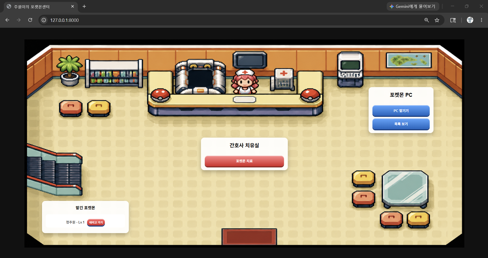

# 주원이의 포켓몬센터



FastAPI와 SQLite를 이용해 만든 포켓몬센터 웹 프로젝트입니다.

포켓몬을 PC에 맡기고 조회하거나 다시 데리고 갈 수 있으며,
간호사 기능을 통해 포켓몬을 치료할 수 있습니다.

---

## 사용 기술

- Python
- FastAPI
- SQLite
- Docker
- Docker Compose
- AWS EC2
- HTML / CSS / JavaScript
- Git / GitHub

---

## 주요 기능

### 포켓몬 PC 기능

- 포켓몬 맡기기
- 포켓몬 목록 조회
- 포켓몬 데리고 가기

### 간호사 기능

- 포켓몬 치료 기능

---

## 프로젝트 실행 방법

### 1. 가상환경 활성화

```bash
source venv/bin/activate
```

### 2. 서버 실행

```bash
python3 -m uvicorn app.main:app --reload
```

### 3. 접속

```text
http://127.0.0.1:8000
```

---

## 시스템 구조

```text
User
 ↓
AWS EC2
 ↓
Docker Compose
 ↓
FastAPI
 ↓
SQLite
```
---

## 프로젝트 구조

```text
pokemon-center
│
├── app
│   ├── main.py
│   ├── computer.py
│   ├── nurse.py
│   ├── database.py
│   │
│   ├── templates
│   │   └── index.html
│   │
│   └── static
│       ├── style.css
│       └── pokemon-center-ui.png
│
├── pokemon.db
├── requirements.txt
└── README.md
```

---

## 배포 주소

```text
http://13.211.170.19:8000
```

## 배운 점

- FastAPI 기반 API 서버 구현
- SQLite를 이용한 데이터 저장 및 삭제
- JavaScript fetch API를 통한 비동기 통신
- Docker 기반 컨테이너 실행 경험
- Docker Compose를 이용한 서비스 실행 관리
- AWS EC2 환경 배포 경험
- GitHub를 이용한 프로젝트 관리 경험
